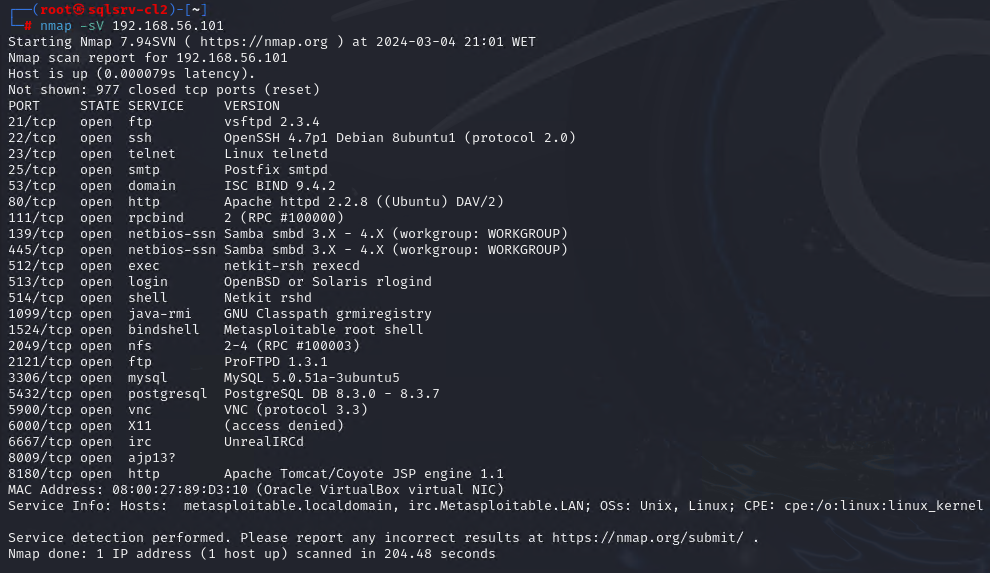
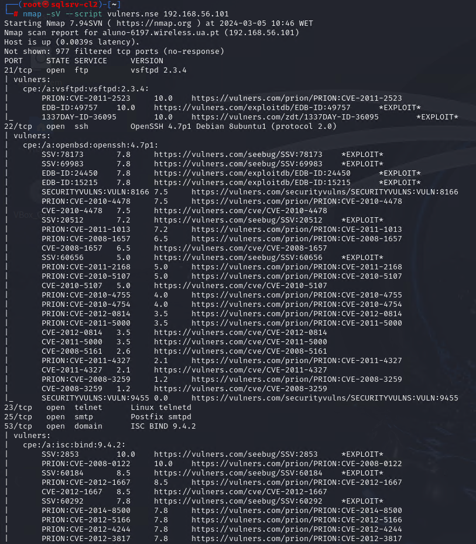
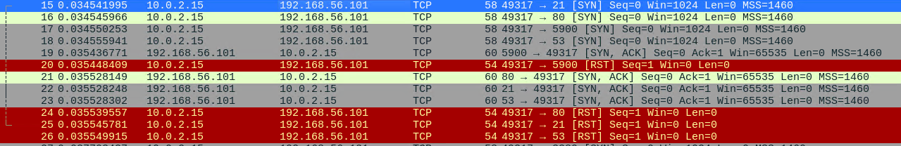
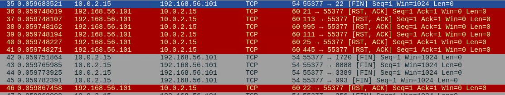

# Домашнее задание к занятию «Уязвимости и атаки на информационные системы» - Михалёв Сергей

---

### Задание 1

Скачайте и установите виртуальную машину Metasploitable: https://sourceforge.net/projects/metasploitable/.

Это типовая ОС для экспериментов в области информационной безопасности, с которой следует начать при анализе уязвимостей.

Просканируйте эту виртуальную машину, используя **nmap**.

Попробуйте найти уязвимости, которым подвержена эта виртуальная машина.

Сами уязвимости можно поискать на сайте https://www.exploit-db.com/.

Для этого нужно в поиске ввести название сетевой службы, обнаруженной на атакуемой машине, и выбрать подходящие по версии уязвимости.

Ответьте на следующие вопросы:

- Какие сетевые службы в ней разрешены?
- Какие уязвимости были вами обнаружены? (список со ссылками: достаточно трёх уязвимостей)
  
**Решение**

* Запуск утилиты *nmap* c ключём *-sV* позволяет определить список портов и доступных для идентификации служб,запущённых на удалённом компьютере.

* Для обнаружения уязвимостей можно воспользоваться:
  *  открытоыми базами данных на сайтах [https://www.exploit-db.com/](https://www.exploit-db.com/) или [https://vulners.com/](https://vulners.com/)
  *  скриптом [*vulners*](https://geekflare.com/nmap-vulnerability-scan/) (*nmap -sV --script vulners*) 
    На скриншоте приведен фрагмент вывода списка уязвимостей в первых трёх найденных сервисах: 
 
---

### Задание 2

Проведите сканирование Metasploitable в режимах SYN, FIN, Xmas, UDP.

Запишите сеансы сканирования в Wireshark.

Ответьте на следующие вопросы:

- Чем отличаются эти режимы сканирования с точки зрения сетевого трафика?
- Как отвечает сервер?

*Приведите ответ в свободной форме.*

**Решение**

* SYN:
    * *nmap -sS* шлёт [SYN] запрос на исследуемую машину (*nmap -sS*)
    * удалённый комп отвечает готовностью к соединению [SYN, ACK]
    * *nmap* отвечает [RST] пакетом для завершения соединения.
  
  Скриншот Wireshark характерный для сканиорвания *nmap -sS*. Здесь "попались" порты 80, 21, 53
    

* FIN:
   * *nmap -sF* отправляет пакет с установленным флагом FIN. 
   * удалённый комп сбрасывает соединение [RST, ACK]
     
  Скриншот Wireshark характерный для сканиорвания *nmap -sF*. Здесь исследуется 22 порт.
    

---
